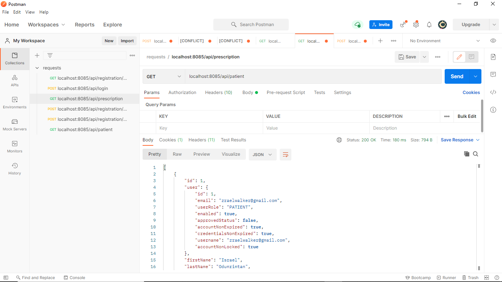

# A SECURE AND SCALABLE REST API BUILT WITH SPRING FRAMEWORK, POSTGRESQL AND HIBERNATE 

**This is a spring-boot api project with postgresql database.** 

A hospital management system with user access levels (ADMIN, DOCTOR, NURSE, PATIENT), built into a REST API with secure endpoints.

[**API documentation**](https://hospital-management-rest--api.herokuapp.com/swagger-ui.html)

**Features:**

- [x] Spring Boot
- [x] Spring MVC
- [x] Spring Security
- [x] Registration and Login
- [x] Java Mail
- [x] Email verification with expiration

